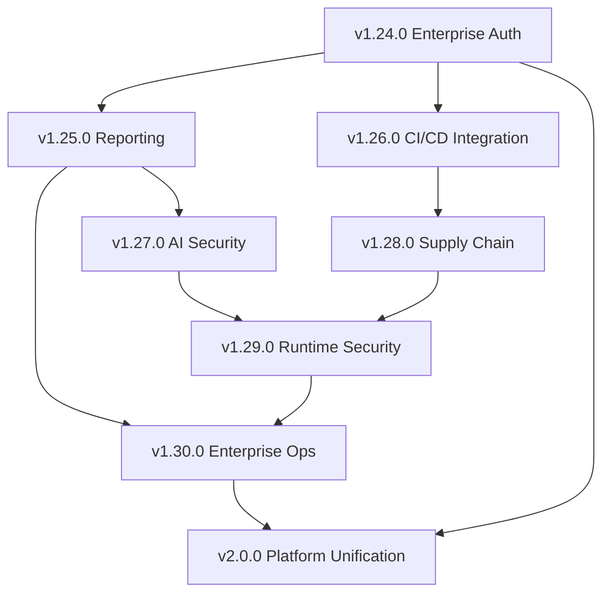

# CI-CO Security Platform Roadmap

## Executive Summary

CI-CO is a comprehensive CI/CD Security Scanning Platform with Model Context Protocol (MCP) integration, currently at version v1.23.0 with 99 tools across 16 categories. This roadmap outlines the strategic evolution from v1.24.0 to v2.0.0 and beyond, focusing on enterprise readiness, advanced security capabilities, and operational excellence.

---

## Current State Analysis (v1.23.0)

### Existing Capabilities

| Category | Tool Count | Key Features |
|----------|------------|--------------|
| Trivy Scanning | 11 | Image, path, SBOM, IaC, secrets, licenses |
| SonarQube | 4 | Projects, issues, hotspots, metrics |
| Dependency-Track | 5 | Projects, vulnerabilities, findings, SBOM upload |
| Gitea Integration | 6 | Repos, branches, commits, migrations |
| Drone CI | 5 | Repos, builds, logs, triggers |
| Container Registry | 10 | Multi-registry, batch scanning, ECR/ACR/GCR/GHCR |
| Scheduling | 10 | Cron-based automation, history, webhooks |
| SARIF/Reporting | 3 | GitHub Code Scanning, file export |
| Remediation | 5 | Fix commands, priority sorting, markdown output |
| Compliance | 7 | SOC2, HIPAA, PCI-DSS, CIS controls, trends |
| OPA/Rego Policies | 4 | Built-in policies, validation, evaluation |
| Vulnerability DB | 7 | Offline scanning, search, annotations |
| Redis Caching | 6 | Distributed cache, health, invalidation |
| Suppression Mgmt | 7 | SQLite storage, audit logs, expiration |
| Prometheus Metrics | 6 | Collection, pushgateway, snapshots |
| Scan Comparison | 4 | Diff analysis, history, fingerprinting |

### Completed Milestones (20 Issues)

1. Webhook notifications for scan results
2. Test coverage to 80%
3. Custom policy file support
4. Parallel scanning for multiple targets
5. SARIF output format
6. Metrics endpoint for monitoring
7. Scan comparison and diff reporting
8. Vulnerability suppression and allowlisting
9. Auto-upload SBOM to Dependency-Track
10. Container registry batch scanning
11. SARIF report generation and GitHub Code Scanning integration
12. Scheduled scan automation with cron expressions
13. Multi-registry support (Harbor, ECR, ACR, GCR, GHCR)
14. Vulnerability remediation suggestions
15. Compliance Reporting (SOC2, HIPAA, PCI-DSS, CIS)
16. Policy as Code (OPA/Rego)
17. Offline Vulnerability Database
18. Container Image Signing Verification
19. Redis Caching Backend
20. GitHub Actions Marketplace Action

---

## Roadmap Milestones

### Milestone 1: v1.24.0 - Enterprise Authentication & RBAC

**Theme:** Enterprise Identity and Access Management

**Release Target:** Q1 2025

**Description:** Implement enterprise-grade authentication and role-based access control to support multi-tenant deployments and compliance requirements.

#### Features

| Feature | Description | New Tools |
|---------|-------------|-----------|
| **SSO Integration** | SAML 2.0 and OIDC authentication with Azure AD, Okta, Keycloak | 4 |
| **RBAC System** | Role-based access control with predefined roles (Admin, Auditor, Developer, Viewer) | 5 |
| **API Key Management** | Scoped API keys with expiration, rotation, and audit logging | 4 |
| **Team Management** | Organizational units, team assignments, and project ownership | 3 |
| **Session Management** | JWT token management, refresh tokens, session audit | 3 |
| **Audit Trail** | Comprehensive audit logging for all actions with retention policies | 3 |

**New Tools:** 22

#### Technical Requirements

```yaml
dependencies:
  - passport-saml: "^4.0.0"
  - openid-client: "^5.0.0"
  - @types/express-session: "^1.17.0"
  - jsonwebtoken: "^9.0.0"

database_changes:
  - users table with role assignments
  - api_keys table with scopes
  - audit_events table
  - teams and team_members tables
```

#### Success Criteria

- [ ] SSO login with Azure AD, Okta, and Keycloak working
- [ ] RBAC enforced across all MCP tools
- [ ] API keys can be created, rotated, and revoked
- [ ] Audit logs capture all authentication and authorization events
- [ ] Team-based project isolation functioning
- [ ] 100% backward compatibility with existing deployments

---

### Milestone 2: v1.25.0 - Advanced Reporting & Visualization

**Theme:** Executive Dashboards and Reporting

**Release Target:** Q1 2025

**Description:** Create comprehensive reporting capabilities with executive dashboards, trend analysis, and customizable report generation.

#### Features

| Feature | Description | New Tools |
|---------|-------------|-----------|
| **Executive Dashboard** | High-level security posture overview with KPIs | 3 |
| **Trend Analysis** | Vulnerability trends over time with forecasting | 4 |
| **Risk Scoring** | CVSS-based risk scores with business context weighting | 3 |
| **Report Builder** | Customizable report templates with scheduling | 4 |
| **PDF/Excel Export** | Export reports in PDF, Excel, and CSV formats | 3 |
| **Comparative Analysis** | Cross-project and cross-team security comparisons | 3 |
| **SLA Tracking** | Track remediation SLAs and escalation workflows | 3 |

**New Tools:** 23

#### Technical Requirements

```yaml
dependencies:
  - puppeteer: "^21.0.0"  # PDF generation
  - exceljs: "^4.4.0"     # Excel export
  - chart.js: "^4.4.0"    # Visualization
  - d3: "^7.8.0"          # Data visualization

new_database_tables:
  - report_templates
  - report_schedules
  - trend_snapshots
  - risk_scores
```

#### Success Criteria

- [ ] Executive dashboard renders in under 3 seconds
- [ ] Trend charts show 90-day history with predictions
- [ ] PDF reports generate with professional formatting
- [ ] SLA violations trigger configurable alerts
- [ ] Comparative analysis across 100+ projects scales
- [ ] Report templates shareable across teams

---

### Milestone 3: v1.26.0 - CI/CD Pipeline Deep Integration

**Theme:** Native Pipeline Integration

**Release Target:** Q2 2025

**Description:** Expand CI/CD integrations beyond GitHub Actions to support all major platforms with native quality gates.

#### Features

| Feature | Description | New Tools |
|---------|-------------|-----------|
| **GitLab CI Integration** | Native GitLab CI/CD support with MR comments | 4 |
| **Jenkins Plugin** | Jenkins shared library for security scanning | 4 |
| **Azure DevOps Extension** | Azure Pipelines task with security gates | 4 |
| **CircleCI Orb** | Reusable CircleCI orb for scanning | 3 |
| **Tekton Tasks** | Cloud-native Tekton pipeline tasks | 3 |
| **ArgoCD Integration** | GitOps scanning before deployment | 3 |
| **Quality Gates API** | Universal quality gate API for any CI system | 4 |

**New Tools:** 25

#### Technical Requirements

```yaml
new_directories:
  - .gitlab/ci/security-scan/
  - jenkins/security-scan-library/
  - azure-devops/security-scan-task/
  - circleci/security-scan-orb/
  - tekton/security-scan-tasks/

integration_apis:
  - GitLab CI API v4
  - Jenkins REST API
  - Azure DevOps REST API
  - CircleCI API v2
```

#### Success Criteria

- [ ] GitLab MR comments posted automatically
- [ ] Jenkins builds fail on policy violations
- [ ] Azure DevOps quality gates block releases
- [ ] All CI platforms have equivalent feature parity
- [ ] Quality gate API responds in under 500ms
- [ ] Documentation for each platform complete

---

### Milestone 4: v1.27.0 - AI-Powered Security Intelligence

**Theme:** Machine Learning and AI-Enhanced Security

**Release Target:** Q2 2025

**Description:** Leverage AI/ML to enhance vulnerability prioritization, false positive detection, and remediation recommendations.

#### Features

| Feature | Description | New Tools |
|---------|-------------|-----------|
| **Smart Prioritization** | ML-based vulnerability prioritization using exploitability data | 4 |
| **False Positive Detection** | AI-assisted false positive identification with learning | 4 |
| **Remediation AI** | Claude/GPT-powered remediation code generation | 4 |
| **Threat Intelligence** | Integration with EPSS, KEV, and threat feeds | 4 |
| **Anomaly Detection** | Detect unusual vulnerability patterns | 3 |
| **Natural Language Queries** | Ask security questions in plain English | 3 |
| **Predictive Risk** | Predict future vulnerabilities based on codebase patterns | 3 |

**New Tools:** 25

#### Technical Requirements

```yaml
dependencies:
  - "@anthropic-ai/sdk": "^0.20.0"
  - "openai": "^4.0.0"
  - "transformers.js": "^2.0.0"

external_integrations:
  - FIRST EPSS API
  - CISA KEV Database
  - NVD CVE API 2.0
  - VulnDB Commercial Feed (optional)

ai_models:
  - vulnerability-prioritization-v1
  - false-positive-classifier-v1
  - remediation-generator-v1
```

#### Success Criteria

- [ ] Prioritization accuracy >85% vs manual triage
- [ ] False positive detection precision >90%
- [ ] AI-generated remediations compile without errors
- [ ] EPSS/KEV data integrated within 24h of publication
- [ ] Natural language queries answer 80% of common questions
- [ ] Model inference latency under 2 seconds

---

### Milestone 5: v1.28.0 - Supply Chain Security

**Theme:** End-to-End Supply Chain Protection

**Release Target:** Q3 2025

**Description:** Comprehensive supply chain security with provenance verification, SLSA compliance, and dependency trust scoring.

#### Features

| Feature | Description | New Tools |
|---------|-------------|-----------|
| **SLSA Compliance** | Generate and verify SLSA provenance attestations | 4 |
| **Sigstore Integration** | Keyless signing with Fulcio and Rekor verification | 4 |
| **Dependency Trust Score** | Calculate trust scores for dependencies | 3 |
| **Supply Chain Graph** | Visualize complete dependency trees with risk | 3 |
| **Malicious Package Detection** | Detect typosquatting and malicious packages | 3 |
| **Build Reproducibility** | Verify reproducible builds | 3 |
| **SBOM Attestations** | Sign and verify SBOM integrity | 3 |

**New Tools:** 23

#### Technical Requirements

```yaml
dependencies:
  - sigstore: "^2.0.0"
  - in-toto-js: "^1.0.0"
  - cosign: CLI integration

external_services:
  - Sigstore (Fulcio, Rekor)
  - deps.dev API
  - Socket.dev API (optional)
  - Snyk API (optional)

slsa_levels:
  - SLSA 1: Source + Build
  - SLSA 2: Signed provenance
  - SLSA 3: Verified builds
```

#### Success Criteria

- [ ] SLSA Level 3 provenance generation working
- [ ] Sigstore keyless signing integrated
- [ ] Dependency trust scores calculate in under 5 seconds
- [ ] Supply chain graph renders 1000+ node trees
- [ ] Malicious package detection catches 95% of known bad packages
- [ ] SBOM attestations verify correctly

---

### Milestone 6: v1.29.0 - Runtime Security Integration

**Theme:** Shift-Right Security

**Release Target:** Q3 2025

**Description:** Extend security scanning to runtime environments with Kubernetes integration, runtime vulnerability correlation, and live threat detection.

#### Features

| Feature | Description | New Tools |
|---------|-------------|-----------|
| **Kubernetes Operator** | K8s operator for continuous cluster scanning | 4 |
| **Runtime Correlation** | Correlate CVEs with running workloads | 3 |
| **eBPF Integration** | Runtime threat detection via eBPF (Falco/Tetragon) | 4 |
| **Admission Controller** | Block vulnerable images from deployment | 3 |
| **Workload Profiling** | Track actual syscalls vs CVE impact | 3 |
| **Live Patching Tracking** | Track which vulns are patched at runtime | 3 |
| **Network Policy Analysis** | Analyze K8s network policies for security gaps | 3 |

**New Tools:** 23

#### Technical Requirements

```yaml
kubernetes_resources:
  - CustomResourceDefinition: SecurityScans
  - Deployment: security-scanner-controller
  - ValidatingWebhookConfiguration: image-policy
  - ServiceAccount with RBAC

integrations:
  - Kubernetes API
  - Falco Events API
  - Tetragon Events API
  - OPA Gatekeeper
```

#### Success Criteria

- [ ] Kubernetes operator reconciles scans automatically
- [ ] Runtime correlation identifies which vulns are exploitable
- [ ] Admission controller blocks 100% of policy violations
- [ ] eBPF integration detects common attack patterns
- [ ] Workload profiling reduces false positives by 40%
- [ ] Works on EKS, GKE, AKS, and vanilla K8s

---

### Milestone 7: v1.30.0 - Enterprise Operations

**Theme:** Production-Grade Operations

**Release Target:** Q4 2025

**Description:** Enterprise operational features including high availability, disaster recovery, and advanced monitoring.

#### Features

| Feature | Description | New Tools |
|---------|-------------|-----------|
| **High Availability** | Active-active deployment with shared state | 3 |
| **Disaster Recovery** | Automated backup and restore with RTO/RPO guarantees | 4 |
| **Advanced Monitoring** | OpenTelemetry tracing, custom dashboards | 4 |
| **Rate Limiting** | Intelligent rate limiting with burst handling | 2 |
| **Queue Management** | Scan queue with priority and retries | 3 |
| **Health Checks** | Deep health checks with dependency status | 2 |
| **Configuration Management** | Centralized config with hot reload | 3 |

**New Tools:** 21

#### Technical Requirements

```yaml
infrastructure:
  - PostgreSQL for shared state
  - Redis Cluster for caching
  - RabbitMQ for scan queues
  - S3-compatible storage for backups

observability:
  - OpenTelemetry SDK
  - Grafana dashboards
  - PagerDuty integration
  - Custom alerting rules
```

#### Success Criteria

- [ ] 99.99% uptime SLA achievable
- [ ] RTO under 15 minutes, RPO under 5 minutes
- [ ] Distributed tracing for all operations
- [ ] Scan queue handles 10,000+ pending scans
- [ ] Health checks cover all dependencies
- [ ] Config changes apply without restart

---

### Milestone 8: v2.0.0 - Platform Unification

**Theme:** Next-Generation Security Platform

**Release Target:** Q4 2025

**Description:** Major version release unifying all capabilities into a cohesive platform with breaking API changes for improved consistency.

#### Features

| Feature | Description | New Tools |
|---------|-------------|-----------|
| **Unified Data Model** | Consistent data model across all security sources | 0 (refactor) |
| **GraphQL API** | Modern GraphQL API alongside REST | 4 |
| **Plugin System** | Extensible plugin architecture for custom tools | 4 |
| **Template Engine** | Customizable scan templates and workflows | 3 |
| **Notification Hub** | Unified notification management (email, Slack, Teams, PagerDuty) | 4 |
| **Security Posture Score** | Single score representing overall security health | 2 |
| **White-Label Support** | Customizable branding and theming | 2 |

**New Tools:** 19

#### Breaking Changes

```yaml
api_changes:
  - Tool names standardized to verb_noun format
  - Response types unified across all scanners
  - Error handling standardized
  - Authentication required for all operations
  - Deprecated tools removed

migration_guide:
  - v1.x to v2.0 migration script provided
  - 6-month deprecation period for old APIs
  - Backward compatibility layer available as opt-in
```

#### Success Criteria

- [ ] All APIs follow consistent naming conventions
- [ ] GraphQL API achieves feature parity with REST
- [ ] Plugin SDK documented with example plugins
- [ ] Migration script handles 99% of deployments
- [ ] Security Posture Score validated by security teams
- [ ] Performance improved by 25% vs v1.x

---

## Summary: Tools by Milestone

| Version | Theme | New Tools | Cumulative Total |
|---------|-------|-----------|------------------|
| v1.23.0 | Current | - | 99 |
| v1.24.0 | Enterprise Auth & RBAC | 22 | 121 |
| v1.25.0 | Advanced Reporting | 23 | 144 |
| v1.26.0 | CI/CD Pipeline Integration | 25 | 169 |
| v1.27.0 | AI-Powered Security | 25 | 194 |
| v1.28.0 | Supply Chain Security | 23 | 217 |
| v1.29.0 | Runtime Security | 23 | 240 |
| v1.30.0 | Enterprise Operations | 21 | 261 |
| v2.0.0 | Platform Unification | 19 | 280 |

---

## Dependencies Between Milestones



### Critical Path

1. **v1.24.0 (Auth/RBAC)** - Foundation for all enterprise features
2. **v1.25.0 (Reporting)** - Required for executive buy-in
3. **v1.27.0 (AI)** - Differentiator in market
4. **v1.30.0 (Enterprise Ops)** - Required for production deployments
5. **v2.0.0 (Unification)** - Platform maturity

---

## Resource Requirements

### Development Team

| Role | v1.24-1.26 | v1.27-1.29 | v1.30-2.0 |
|------|------------|------------|-----------|
| Backend Engineers | 3 | 4 | 3 |
| Security Engineers | 1 | 2 | 2 |
| DevOps Engineers | 1 | 2 | 2 |
| ML Engineers | 0 | 2 | 0 |
| QA Engineers | 1 | 2 | 2 |
| Technical Writers | 1 | 1 | 2 |

### Infrastructure

- **Development:** Kubernetes cluster, CI/CD pipelines, staging environments
- **Testing:** Vulnerability databases, sample applications, compliance test suites
- **AI/ML:** GPU instances for model training, inference endpoints
- **Production:** Multi-region deployment capability, DR infrastructure

---

## Risk Assessment

| Risk | Probability | Impact | Mitigation |
|------|-------------|--------|------------|
| AI model accuracy below target | Medium | High | Extensive testing, human-in-the-loop fallback |
| Breaking changes cause migration issues | Medium | High | Migration tooling, extended deprecation period |
| Runtime integration complexity | High | Medium | Start with EKS/GKE, expand to others |
| Supply chain dependencies change | Low | High | Abstract vendor APIs, multiple providers |
| Enterprise adoption slower than expected | Medium | Medium | Focus on GitHub Actions adoption first |

---

## Success Metrics

### Platform Health

- **Test Coverage:** >80% for all new code
- **API Response Time:** p95 < 500ms
- **Scan Throughput:** 1000+ scans/hour
- **Uptime:** 99.9% availability

### Adoption

- **GitHub Marketplace Installs:** 10,000+ by v2.0
- **Enterprise Customers:** 50+ by v2.0
- **Community Contributors:** 100+ by v2.0
- **Documentation Coverage:** 100% of tools documented

### Security

- **CVE Detection Rate:** >95% for covered ecosystems
- **False Positive Rate:** <5%
- **Time to Update:** <24h for new CVEs
- **Compliance Coverage:** 100% of SOC2/HIPAA/PCI-DSS controls

---

## Appendix A: Tool Categories (v2.0.0 Target)

| Category | v1.23.0 | v2.0.0 | Growth |
|----------|---------|--------|--------|
| Authentication & RBAC | 0 | 22 | New |
| Trivy Scanning | 11 | 15 | +4 |
| SonarQube | 4 | 6 | +2 |
| Dependency-Track | 5 | 8 | +3 |
| Git Integration | 6 | 10 | +4 |
| CI/CD Pipelines | 5 | 30 | +25 |
| Container Registry | 10 | 15 | +5 |
| Scheduling | 10 | 12 | +2 |
| SARIF/Reporting | 3 | 26 | +23 |
| Remediation | 5 | 12 | +7 |
| Compliance | 7 | 10 | +3 |
| OPA/Rego Policies | 4 | 6 | +2 |
| Vulnerability DB | 7 | 12 | +5 |
| Caching | 6 | 8 | +2 |
| Suppression | 7 | 9 | +2 |
| Metrics | 6 | 10 | +4 |
| Scan Comparison | 4 | 6 | +2 |
| AI/ML Security | 0 | 25 | New |
| Supply Chain | 0 | 23 | New |
| Runtime Security | 0 | 23 | New |
| Enterprise Ops | 0 | 21 | New |
| Platform | 0 | 19 | New |

---

## Appendix B: API Versioning Strategy

### Versioning Scheme

- **URL Path:** `/api/v1/`, `/api/v2/`
- **Header:** `Accept: application/vnd.cico.v2+json`
- **MCP Version:** Tool metadata includes API version

### Deprecation Policy

1. **Announcement:** 6 months before removal
2. **Warning Headers:** `Deprecation: true` header on deprecated endpoints
3. **Documentation:** Migration guides published
4. **Support:** Extended support for enterprise customers

---

## Appendix C: Configuration Examples

### v2.0.0 Platform Configuration

```yaml
# cico.config.yaml
version: "2.0"
platform:
  name: "ACME Security Platform"
  branding:
    logo: "/assets/logo.png"
    primaryColor: "#1a73e8"

authentication:
  provider: "oidc"
  oidc:
    issuer: "https://login.example.com"
    clientId: "${OIDC_CLIENT_ID}"
    clientSecret: "${OIDC_CLIENT_SECRET}"
    scopes: ["openid", "profile", "email"]

scanning:
  defaults:
    severity: "HIGH,CRITICAL"
    timeout: 300
  parallelism: 10

ai:
  enabled: true
  provider: "anthropic"
  model: "claude-3-opus"
  features:
    - prioritization
    - remediation
    - falsePositiveDetection

integrations:
  github:
    enabled: true
    appId: "${GITHUB_APP_ID}"
  gitlab:
    enabled: true
    token: "${GITLAB_TOKEN}"
  jira:
    enabled: true
    baseUrl: "https://jira.example.com"

notifications:
  slack:
    enabled: true
    webhookUrl: "${SLACK_WEBHOOK}"
    channels:
      critical: "#security-critical"
      high: "#security-alerts"
```

---

## Document History

| Version | Date | Author | Changes |
|---------|------|--------|---------|
| 1.0 | 2024-12-28 | Architecture Team | Initial roadmap |

---

*This roadmap is a living document and will be updated quarterly based on customer feedback, market conditions, and technical discoveries.*
